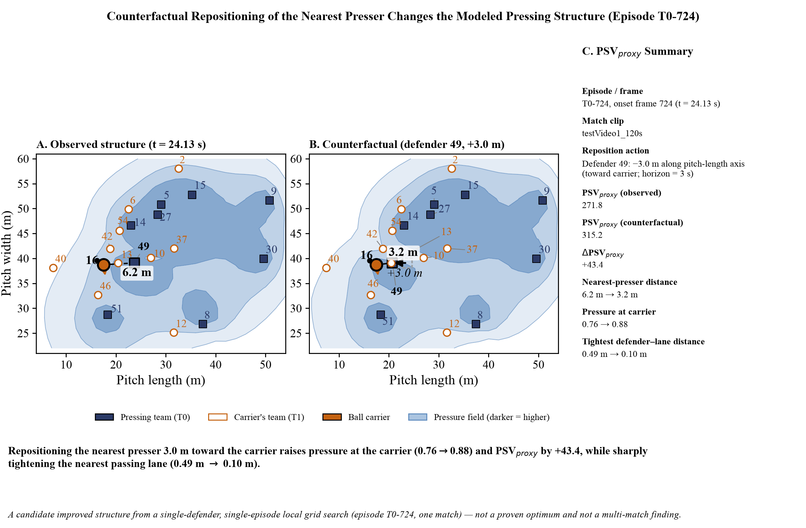
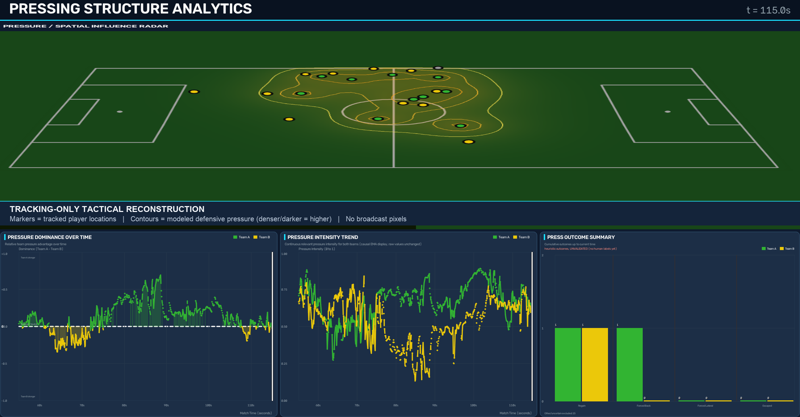

# Best Spatial Structure for Pressing in Football

## Beyond Compactness: A Spatial-Geometry Framework for Valuing Pressing Structure and Testing Counterfactual Defender Positions

This repository contains a research prototype for describing the spatial structure of football pressing from single-camera broadcast tracking. It measures pressure geometry, detects press episodes, constructs a provisional Pressing Structure Value proxy, and tests bounded counterfactual defender positions. The study is exploratory and does not establish causal effects or a universally optimal pressing structure.

Repository: [https://github.com/RupayanHalder39/Problem4_Best_Spatial_Structure_for_Pressing_Football](https://github.com/RupayanHalder39/Problem4_Best_Spatial_Structure_for_Pressing_Football)

## Paper

- [Final paper PDF](paper/Pressing_Structure_MIT_Sloan_Public_Final.pdf)
- [Final editable DOCX](paper/Pressing_Structure_MIT_Sloan_Public_Final.docx)

## Research Question

Can the spatial geometry of a football press be measured, connected to opponent progression, and used to test how repositioning an individual defender changes the modeled pressing structure?

## Why This Matters

A coach can see that a press succeeded or failed, but it is harder to quantify why the spatial structure worked and whether a defender could have occupied a better position. This project converts tracked positions into an inspectable pressure field and episode-level spatial features. It then tests local candidate repositionings without treating them as proven tactical optima.

## Study Data

The current study uses one 120-second segment of single-camera broadcast video tracked at 30 frames per second. The finite-state pipeline detects 19 press episodes: 11 for Team A and 8 for Team B. Each episode has 59 features across geometry, motion, escape, field, and context families.

Heuristic outcome attribution resolves only three episodes: two `BALL_REGAIN` and one `FORCED_BACKWARD`. The remaining 16 are `UNCERTAIN`. These labels are not a substitute for human adjudication.

## Method

```text
broadcast video and tracking
        -> player locations and motion
        -> continuous pressure field
        -> finite-state press detection
        -> episode-level spatial features
        -> PSV_proxy
        -> bounded defender repositioning
        -> coaching visualization
```

The pressure field combines defender influence using an independent-OR aggregate. The continuous `opp_ballw` signal samples each team's pressure field at opponent locations and weights those samples by ball proximity when the ball is observed. When the ball is unavailable, the implementation uses a documented unweighted fallback.

Signed pressure dominance is `I_A - I_B`. Zero is therefore the balance point between the two directions. The separately calibrated 0.633 threshold is an optional, single-clip pressure-intensity gate for low-pressure periods; it is not the zero line and is not presented as a universal constant.

## Pressing Structure Value

`PSV_proxy` is a provisional progression-based proxy, not a validated universal metric. It estimates forward progress suppressed over a short horizon:

```text
PSV_proxy = expected forward progress without pressure
          - predicted forward progress under the observed pressure field
```

The current formula uses a constant-velocity projection and pressure at the carrier. It does not contain an xT or EPV model, and it has not been validated against match outcomes.

## Main Findings

- 19 detected press episodes: 11 for Team A and 8 for Team B.
- 59 features per episode, with 19 complete rows and zero skipped cases.
- 68.2% frame coverage for the continuous pressure-intensity signal.
- Cohen's d = +0.661 between `PRESS_FORMING` and `NO_PRESS` frames.
- Mean correlation r = +0.315 with the existing discrete press score.
- Mean signed-dominance change of +0.109 for the pressing team's own episodes and +0.027 for the opponent's episodes.
- Episode `T0-724`: moving the nearest presser 3 m toward the carrier along the pitch-length axis produced a candidate `PSV_proxy` improvement of +43.4.
- Only 3 outcomes were concretely attributed; 16 remained uncertain.

These are descriptive results from one short match segment. They do not support a goal correlation or a validated `PSV_proxy`-outcome relationship.

## Counterfactual Repositioning

The local search moves one defender by +/-1 m, +/-2 m, or +/-3 m on each axis, clips every candidate to the pitch, and recomputes the pressure field and `PSV_proxy`. The reported +43.4 result is the best candidate found within that bounded grid for one episode. It is not a global optimum and does not demonstrate what would have happened in the match.

## Figures

### Counterfactual defender repositioning



### Practitioner-facing pressing review



The second figure is a tracking-only practitioner view. The tactical board shows tracked player locations and modeled defensive-pressure contours; the three charts retain the validated signed-dominance, pressure-intensity, and outcome-count signals. It contains no broadcast pixels. Zero is the signed-dominance balance reference. The separate 0.633 pressure-intensity threshold is the single-clip low-pressure gate and is not a universal constant.

## Video Demonstrations

Three scientifically relevant generated dashboard videos were audited: one 120-second render and two 20-second renders. All contain underlying broadcast footage. They are withheld because redistribution authorization has not been confirmed. The complete inventory, durations, sizes, and release recommendation appear in [PUBLIC_RELEASE_AUDIT.md](PUBLIC_RELEASE_AUDIT.md).

If authorization is obtained, add the approved files under `videos/`, update this section with repository-relative links, and use Git LFS or a release asset for the 195.5 MB full render.

## Reproduction

Create an environment and install the Python dependencies:

```bash
python -m venv .venv
source .venv/bin/activate
pip install -r requirements.txt
```

Set the repository source path:

```bash
export PYTHONPATH="$PWD/src"
```

To reproduce episode features, provide the non-public tracking and derived analytics files described in [data/README.md](data/README.md), then run:

```bash
python scripts/export_pressing_features.py \
  --tracking data/private/tracking/testVideo1_120s/tracking.parquet \
  --analytics-dir data/private/analytics/testVideo1_120s_v3 \
  --output results/tables/pressing_episode_features.parquet
```

The public package can validate imports and static assets without the restricted inputs:

```bash
python scripts/validate_public_package.py
```

## Data Availability

This package includes source code, the final paper, approved research figures, and a verified result summary. It does not include raw broadcast footage, the tracking parquet, ball trajectories, passes, turnovers, homography calibration, or the frozen dashboard snapshot. Their copyright, provenance, and redistribution terms have not been established for public release.

Users who have lawful access to equivalent inputs can reproduce the pipeline by following [data/README.md](data/README.md). The current repository therefore supports conditional, not full, reproducibility.

## Limitations

- One match segment lasting 120 seconds.
- Only 19 detected press episodes.
- Only 3 concretely attributed heuristic outcomes; 16 are uncertain.
- No defensible goal correlation.
- No validated `PSV_proxy`-outcome relationship.
- No causal claims.
- Local, bounded counterfactual search rather than global optimization.
- Single-camera broadcast tracking and homography limitations.
- Multi-match evaluation and human-adjudicated outcomes are still required.

## Researcher


Rupayan Halder

- PhD Student — Jadavpur University, Kolkata
- Football AI Researcher
- Assistant Professor — University of Engineering & Management (UEM), Kolkata
- Research Collaborator — SoccerSolver
- Former Software Engineer — Platform Engineering — Session AI

Rupayan's research interests focus on applying artificial intelligence, machine learning, data analytics, and computational methods to real-world problems in football, including player performance analysis, recruitment, transfer-market decision-making, and sporting strategy.

## Connect

- GitHub: [RupayanHalder39](https://github.com/RupayanHalder39)
- LinkedIn: [rupayan-halder-962922209](https://www.linkedin.com/in/rupayan-halder-962922209/)
- Email: rupayanhalder313239@gmail.com

## Research Collaboration


This research was developed in collaboration with SoccerSolver. SoccerSolver currently works with more than 10 football clubs.

## Citation

Provisional citation metadata is provided in [CITATION.cff](CITATION.cff). Rupayan Halder is the confirmed named contributor for this package; the complete submission author list has not yet been finalized.

## License

Project-controlled source code is available under the scoped [MIT License](LICENSE). The scope and exclusions are detailed in [NOTICE.md](NOTICE.md). The license does not cover footage, source or tracking data, row-level derived datasets, the researcher photograph, the SoccerSolver logo, third-party assets, or third-party code governed by its own license. The vendored Roboflow `sports` helpers retain their upstream MIT notice in [docs/THIRD_PARTY_SPORTS_LICENSE.txt](docs/THIRD_PARTY_SPORTS_LICENSE.txt).
